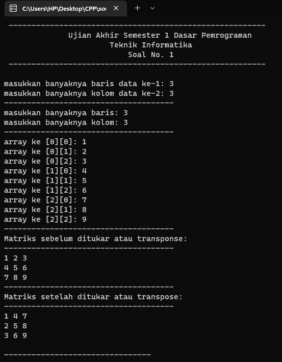

# Ujian Akhir Semester 1
<br>Mata Kuliah&ensp;&ensp; : Dasar Pemrograman
<br>Nama&ensp;&ensp;&ensp;&ensp;&ensp;&ensp;&ensp;&nbsp;: Muhammad Alfiyan Nurwahibulloh Rohayana
<br>NIM&emsp;&emsp;&emsp;&emsp;&nbsp; : 1227050084
<br>Jurusan&emsp;&emsp;&emsp;: [Teknik Informatika](http://if.uinsgd.ac.id/) [UIN Sunan Gunung Djati Bandung](https://uinsgd.ac.id/) 

## Deskripsi Umum No. 1

Pada Ujian Akhir Semester Dasar Pemrograman No. 1, diberikan soal untuk membuat sebuah program di C++ Programming yaitu membuat Matriks yang menukar setiap baris menjadi kolom dan setiap kolom menjadi baris. Pertama-tama, membuat variabel data_1 dan data_2 untuk memasukkan banyaknya data pada array dan membuat variabel baris dan kolom untuk menentukan baris dan kolom serta membuat variabel tukar yang akan digunakan untuk menukar baris dan kolomnya. Semua variabel di atas akan diinputkan oleh user. Setelah itu, membuat program for looping untuk menginputkan nilai data dan mengoutputnya. Kemudian melakukan program for looping untuk menyimpan variabel tukar di variabel arr untuk melakukan program tukar baris dan kolom. Setelah melakukan program tukar, terakhir outputkan variabel tukar yang telah diprogram untuk menukar baris dan kolomnya.

## Source Code No. 1
```
#include <iostream>
using namespace std;

int main(){
	
	//deklarasi variabel untuk input banyaknya data
	int data_1, data_2;
	cout << "masukkan banyaknya baris data ke-1: "; cin >> data_1;
	cout << "masukkan banyaknya kolom data ke-2: "; cin >> data_2;
	cout << "-------------------------------------\n";
	
	// deklarasi variabel untuk input baris, kolom, dan menampung data_1 & data_2
	int arr[data_1][data_2], tukar[data_1][data_2], baris, kolom;
	cout << "masukkan banyaknya baris: "; cin >> baris;
	cout << "masukkan banyaknya kolom: "; cin >> kolom;
	cout << "-------------------------------------\n";
	
	// for looping input nilai datanya
	for (int i=0; i<baris; i++){
		for (int j=0; j<kolom; j++){
			cout << "array ke [" << i << "][" << j << "]: "; cin >> arr[i][j];
		}
	}
	
	cout << "-------------------------------------\n";
	cout << "Matriks sebelum ditukar atau transponse:\n";
	cout << "-------------------------------------\n";
	
	// for looping output nilai datanya menjadi matriks sebelum di transpose
	for (int i=0; i<baris; i++){
		for (int j=0; j<kolom; j++){
			cout << arr[i][j] << " ";
		}
		cout << endl;
	}
	
	cout << "-------------------------------------\n";
	cout << "Matriks setelah ditukar atau transpose:\n";
	cout << "-------------------------------------\n";
	
	// for looping untuk menyimpan variabel transpose atau tukar matriks
	for (int i=0; i<baris; i++){
		for (int j=0; j<kolom; j++){
			tukar[j][i] = arr[i][j];
		}
	}

	// for looping output matriks setelah ditranspose atau tukar;
	for (int i=0; i<kolom; i++){
		for (int j=0; j<baris; j++){
			cout << tukar[i][j] << " ";
		}
		cout << endl;
	}	
}
```

## Output No. 1




## Deskripsi Umum No. 2

## Source Code No. 2
```
```

## Output No. 2

